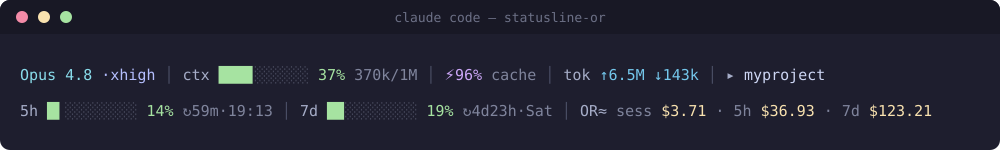

# statusline-or

A custom [Claude Code](https://docs.claude.com/en/docs/claude-code) status line with **rate-limit progress bars** and **OpenRouter / API-equivalent cost tracking** — session, current 5-hour block, and current weekly window.

Self-contained: pure Node, **no dependencies**, no Nerd Fonts required. Renders cleanly in Windows Terminal, iTerm2, and any modern terminal with 24-bit color.

[](LICENSE)




```
Opus 4.8 ·xhigh │ ctx ███▊░░░░░░ 37% 370k/1M │ ⚡96% cache │ tok ↑6.5M ↓143k │ ▸ myproject
5h █▍░░░░░░░░ 14% ↻59m·19:13 │ 7d █▉░░░░░░░░ 19% ↻4d23h·Sat │ OR≈ sess $3.71 · 5h $36.93 · 7d $123.21
```

## Features

- **Two adaptive lines** (costs wrap to a third line automatically on narrow terminals).
- **Context window bar** with token count and size (200k / 1M aware).
- **Cache hit %** and cumulative **token counts** (↑ sent incl. cache reads, ↓ generated).
- **5-hour and weekly rate-limit bars** with usage % and **reset countdowns** (`↻` + clock / weekday).
- **Cost trio** (`OR≈ sess · 5h · 7d`) — API-equivalent dollars, computed from your own transcripts:
  - **sess** — the current conversation
  - **5h** — spend in the current 5-hour rate-limit block
  - **7d** — spend in the current weekly window (aligned to your reset, e.g. Sat→Sat)
- **4 truecolor themes** (catppuccin, tokyonight, gruvbox, nord) — switch with one word.
- **Accurate**: per-model pricing, global de-duplication, validated within ~5% of [ccusage](https://github.com/ryoppippi/ccusage).
- **Fast**: incremental per-file cache; ~1s cold start, ~100 ms thereafter.

## Requirements

- **Node.js 18+** (uses only the standard library).
- **Claude Code 2.1.132+** for the `context_window` fields; `rate_limits` (the 5h/weekly bars and `$` windows) require a Claude.ai subscription session. Without them the bars hide gracefully and costs fall back to rolling windows.
- A terminal with **24-bit color** for the themes (Windows Terminal, iTerm2, WezTerm, Kitty, modern VS Code terminal). Set `NO_COLOR=1` to disable colors.

## Installation

1. **Download** `statusline-or.js` into your Claude config directory:

   ```bash
   # macOS / Linux
   curl -fsSL https://raw.githubusercontent.com/<you>/statusline-or/main/statusline-or.js -o ~/.claude/statusline-or.js
   chmod +x ~/.claude/statusline-or.js   # optional; we invoke via `node`
   ```

   ```powershell
   # Windows (PowerShell)
   Invoke-WebRequest https://raw.githubusercontent.com/<you>/statusline-or/main/statusline-or.js -OutFile "$HOME\.claude\statusline-or.js"
   ```

   Or just copy the file there manually.

2. **Add the status line** to `~/.claude/settings.json` (keep your other settings; only add the `statusLine` key):

   ```json
   {
     "statusLine": {
       "type": "command",
       "command": "node ~/.claude/statusline-or.js",
       "padding": 0,
       "refreshInterval": 10
     }
   }
   ```

   > If `~` isn't expanded on your platform, use an absolute path, e.g.
   > `"command": "node C:/Users/you/.claude/statusline-or.js"`.

3. **Send any message** in a Claude Code session (or restart it). The two lines appear at the bottom and refresh every 10 seconds.

### Try it without Claude Code

Pipe the bundled sample input straight into the script:

```bash
cat example-input.json | node statusline-or.js
```

(The sample's reset timestamps are far in the future, so the `5h`/`7d` cost windows read `$0.00` — live, they reflect your real transcripts.)

## Configuration

### Themes

Change one word near the top of `statusline-or.js`:

```js
const ACTIVE_THEME = process.env.SL_THEME || 'catppuccin'; // catppuccin | tokyonight | gruvbox | nord
```

Or set an environment variable: `SL_THEME=tokyonight`.

### Tweak individual colors

Each theme is a row of hex codes in the `THEMES` table, labelled by what each one paints (`model`, `cost`, `cache`, `tok`, `good/warn/bad` bar heat, etc.). Edit a hex and reload.

## What each part means

**Line 1** — `model ·effort │ ctx [bar] % used/size │ ⚡cache% │ tok ↑in ↓out │ ▸ dir`

- `↑` is everything *sent* to the model (fresh input **+ cache reads + cache writes**); `↓` is what the model *generated*. The ratio is wildly lopsided (often 30:1+) because every turn re-reads the whole conversation from cache — that's normal, and the `⚡cache%` badge shows how much was cached.

**Line 2** — `5h [bar] % ↻reset │ 7d [bar] % ↻reset │ OR≈ sess $ · 5h $ · 7d $`

- The **bars** (`%`) answer *"how close am I to a rate limit, and when does it reset?"*
- The **costs** (`$`) answer *"what have I spent this usage period?"* — paired to the same windows as the bars.

## How the cost is calculated

`OR≈` = **OpenRouter / API-equivalent** dollars. Claude Code's own `cost.total_cost_usd` (used for `sess`) is computed at Anthropic API rates; OpenRouter passes the same per-token Claude rates through, so it's effectively *"what this would have cost on the API."*

The **5h** and **7d** figures are computed from your local transcripts in `~/.claude/projects/**/*.jsonl`:

1. **Per-model pricing** from the [LiteLLM](https://github.com/BerriAI/litellm) table (input / output / cache-read / cache-write). See the `PRICES` block to update rates.
2. **Global de-duplication** by `message.id` — resumed sessions copy prior messages into new transcripts (often >50% duplicate lines), which naive tools double-count.
3. **Windows aligned to your rate-limit resets** — 5h block and weekly window (`resets_at − length`), using exact per-message timestamps.
4. **Incremental cache** at `~/.claude/.statusline-or-cache.json` — only changed files are re-parsed, so the 10 s refresh stays cheap.

Validated within ~5% of `ccusage` (region price variants + cache-tier nuances account for the difference). It's a **rough estimate**, by design.

> **Note:** on a subscription this is *value received*, not money billed. Seeing `7d $1,000` means your subscription saved you ~$1,000 of API spend that week.

### FAQ: "Why does `7d` look low?"

Because it's the spend **since your weekly limit reset**, not a rolling trailing 7 days. Right after a reset it's small and grows through the week — which is exactly why it lines up with the `7d %` bar. (The rate-limit `%` is token-based, not dollar-based, so `%` and `$` won't be perfectly proportional either.)

## Performance

- First run builds the cache (~1 s for a heavy history); subsequent runs ~100 ms.
- Cache is pruned to files within the active windows and capped to ~10 days of records.
- Only files modified within the window are read (older files can't contain in-window messages).

## Credits

- Inspired by [ccstatusline](https://github.com/sirmalloc/ccstatusline) by sirmalloc.
- Cost methodology cross-checked against [ccusage](https://github.com/ryoppippi/ccusage).

## License

[MIT](LICENSE)
